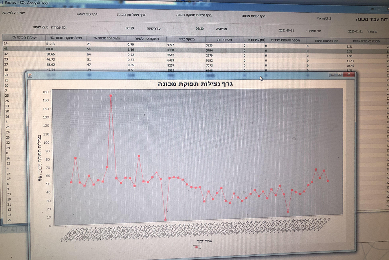
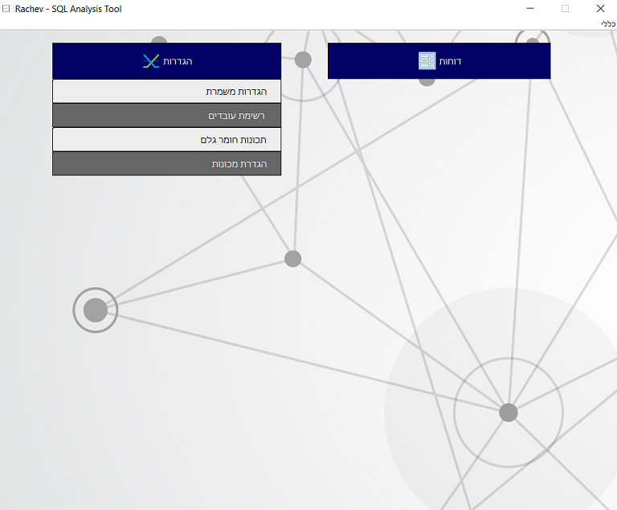
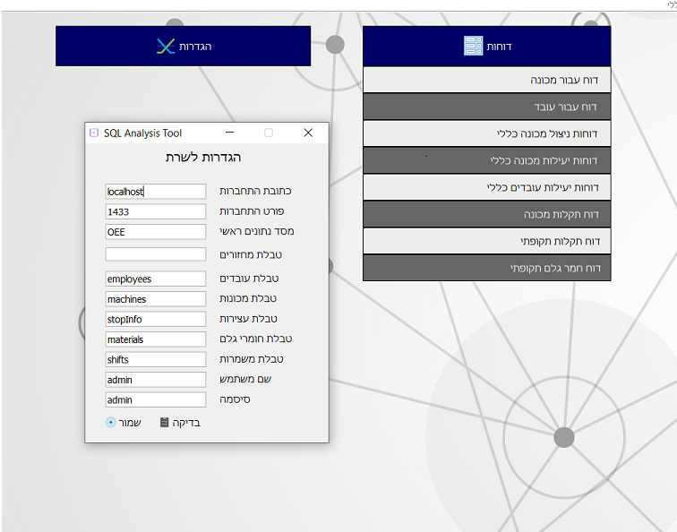
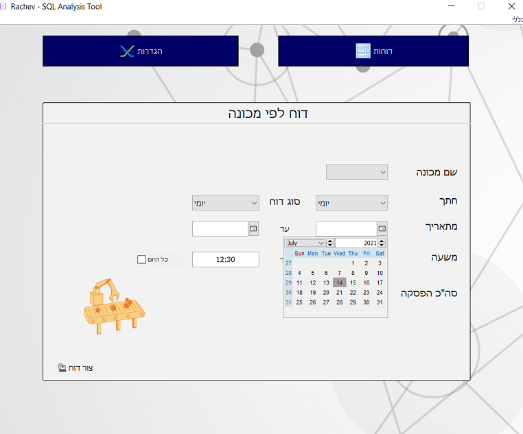

# OEE_Factory

Overall Equipment Effectiveness program.
-----

OEE (Overall Equipment Effectiveness) is the gold standard for measuring manufacturing productivity. Simply put – it identifies the percentage of manufacturing time that is truly productive. An OEE score of 100% means you are manufacturing only Good Parts, as fast as possible, with no Stop Time.

This project was coded for a big factory in ashdod and was meant to be used in order preserve productivity within the factory.

This project required a lot of team work and was coded with the help of my sisters that also study computer science. (We split the project into different parts and each had their own missions)
Over all it took a week to code - mostly because it included a lot of self learning, we had to figure how to interact with SQL server & numerous new libraries that we had to use in order to complete the task properly.

Similiar programs go for *hundred of thousands* in the current market and we simply wanted to challenge ourselves. 

---

**This was coded after we all have finished our first year in computer science! A fun project that we have chosen in order to spend our time properly ;) 

---

How does this work?
-----

* PLC Controllers automatically save their usage info into an SQL server that is ran in the factory. 
* Our program analysis this info and outputs efficency reports - both for machines and workers.

Why would I want to use this as a company CEO?
------
The factory CEO that utilizes our program can easily figure out which worker is the fastest/slowest worker, which machine is non efficent and much more!
The CEO can generate graphs and see all the needed data infront of him, improve his overall factory performance. 

This helps save thousands of dollars in a day ,  who doesn't want to save money nowdays?

------

Pictures
-------

-------

-------

-------

